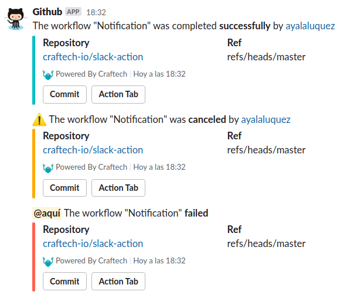

# Slack Action

This action sends a notification of the current status of the job. The possible values for the status are: success, failure, or cancelled.

> Note: You can also use this action to send a status notification based on the results of all of the Workflow jobs. Example, if a workflow has 10 jobs and 1 of them fails, then a failure message will be sent. To use this mode, you just have to define the `gha_api_token` and `run_id` parameters as explained below.

First steps, you need to set GitHub secrets for SLACK_WEBHOOK_URL that is Incoming Webhook URL.
You can customize the following parameters:

- [Sending messages using Incoming Webhooks](https://slack.com/help/articles/115005265063-Incoming-Webhooks-for-Slack)
- [Creating and storing encrypted secrets](https://help.github.com/es/actions/configuring-and-managing-workflows/creating-and-storing-encrypted-secrets)

## Inputs variables

| With Parameter      | Required/Optional | Description                                                                                                                                                                                                      |
| ------------------- | ----------------- | ---------------------------------------------------------------------------------------------------------------------------------------------------------------------------------------------------------------- |
| `slack_webhook_url` | **Required**      | The Slack Incoming Webhooks URL. <br>Please specify the [environment secret](https://help.github.com/es/actions/configuring-and-managing-workflows/creating-and-storing-encrypted-secrets) for SLACK_WEBHOOK_URL |
| `status`            | **_Optional_**    | The result of GitHub Actions job<br>This parameter value must contain the following word:<br>- `success`<br>- `failure`<br>- `cancelled`<br> default is using `${{ job.status }}`                                |
| `slack_channel`     | **_Optional_**    | Override the default incoming Webhook Slack settings                                                                                                                                                             |
| `slack_username`    | **_Optional_**    | Override the default incoming Webhook Slack settings                                                                                                                                                             |
| `gha_api_token`     | **_Optional_**    | The Github Actions API Token to fetch all jobs statuses                                                                                                                                                          |
| `run_id`            | **_Optional_**    | Required if `gha_api_token` is set. This is the Github Actions Workflow run_id and can be found in the `github.run_id` environment variable                                                                      |
| `notify_all`        | **_Optional_**    | If enabled it will include `@here` in the slack message                                                                                                                                                          |
| `report_link`       | **_Optional_**    | The link to the report                                                                                                                                                                                           |


## Usage

usage with the default incoming Webhook Slack settings,

Create the file `workflow.yml` in `.github/workflows` folder.

```yaml
name: The name of your workflow
on [push]

jobs:
  deploy:
    runs-on: ubuntu-latest
    steps:
      - uses: ./.github/github-actions/slack-action@v1
        with:
          slack_webhook_url: ${{ secrets.SLACK_WEBHOOK_URL }}
        if: always()

```

## Scenarios

You can override the default incoming Webhook Slack settings for the channel and username, also only send notification to slack if the job failure, e.g:

Possible values are success, failure, or cancelled.

```yaml

name: The name of your workflow
on [push]

jobs:
  deploy:
    runs-on: ubuntu-latest
    steps:
      - uses: ./.github/github-actions/slack-action@v1
        with:
          slack_webhook_url: ${{ secrets.SLACK_WEBHOOK_URL }}
          slack_channel: general
          slack_username: Github
          status: failure
        if: failure()

```

## Slack UI

Locate the Slack conversation the message was sent to and it should be waiting for you, like this:



Amazing work - you've now implemented notifactions the your workflows!
